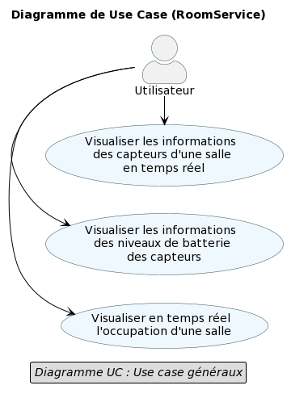
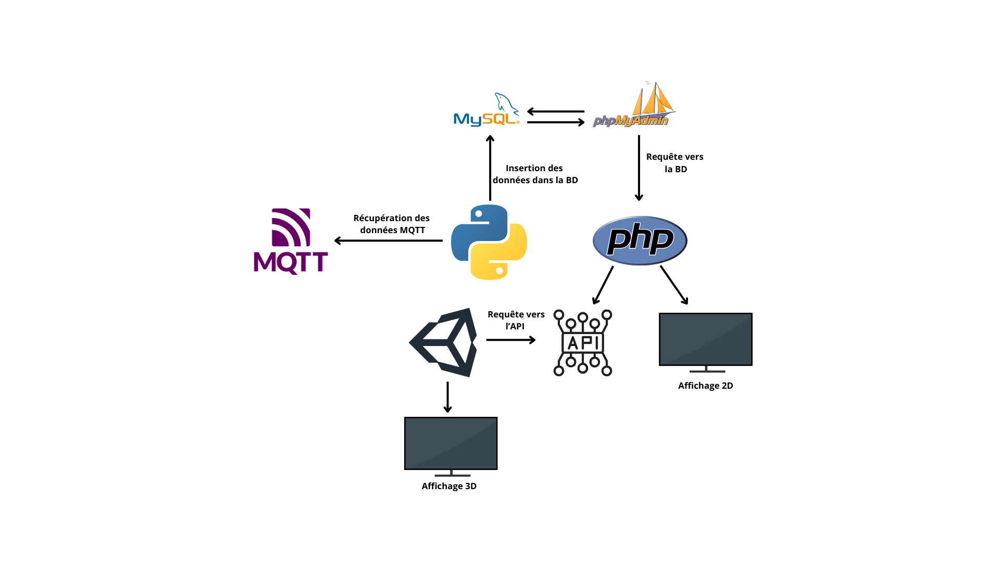
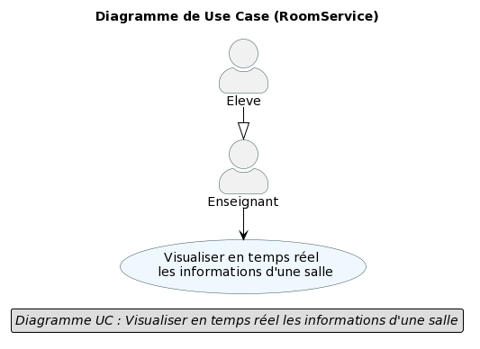
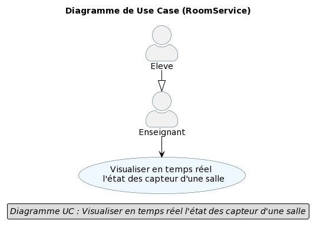
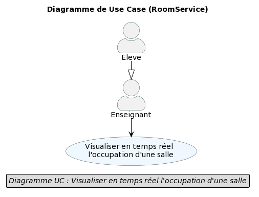

= Documentation Technique - Sujet "Occupation des salles" (Occupation)
:toc:
:toc-title: Sommaire
//:toc: preamble
:toclevels: 5
:sectnums:
:sectnumlevels: 5

:Entreprise: Groupe 1
:Equipe:  

[cols="4"]
|===
|Version | Date | Équipe | Projet
|3.0 | 26 Janvier 2024 | Groupe 1 : Kylian, Mathéo, Yann, Lylian | Développement d'une application
|=== 

== Présentation de l'Application
L'application RoomService permet aux utilisateurs d'avoir en temps réel différentes informations des salles du premier étage du département informatique de l'IUT de blagnac.
De plus, l'application RoomService permet aux utilisateurs de consulter l'historique des informations des salles du premier étage du département informatique de l'IUT de blagnac.
Enfin, l'application RoomService permet aux utilisateurs de consulter les statistiques des informations des salles du premier étage du département informatique de l'IUT de blagnac.

=== Contexte
Le contexte de l'application RoomService est le suivant :
* L'application RoomService est développée par le groupe 1 de la promotion 2024 du département informatique de l'IUT de Blagnac.
* L'application RoomService est développée pour les utilisateurs de l'IUT de Blagnac.
* L'application RoomService est développée pour les utilisateurs de l'IUT de Blagnac qui souhaitent avoir en temps réel différentes informations des salles du premier étage du département informatique de l'IUT de blagnac.
* L'application RoomService est développée pour les utilisateurs de l'IUT de Blagnac qui souhaitent consulter l'historique des informations des salles du premier étage du département informatique de l'IUT de blagnac.

=== Use Case global

L'application RoomService permet aux utilisateurs d'avoir en temps réel différentes informations des salles du premier étage du département informatique de l'IUT de blagnac.
Ces informations récupéré via les capteurs présent dans les salles sont : le taux de CO2, l'occupation des salles, la température et l'humidité.

.Diagramme de Cas d'Utilisation généraux de l'application

* Rôle : L'utilisateur est une personne de l'IUT de Blagnac qui souhaite avoir des informations sur les salles du premier étage du département informatique.
* Responsabilités :
** Consulter les informations des salles du premier étage du département informatique en temps réel.
** Consulter l'historique des informations des salles du premier étage du département informatique.
** Consulter les statistiques des informations des salles du premier étage du département informatique.
** Consulter les rapports des informations des salles du premier étage du département informatique.

=== Diagramme de d'architecture de la base de données

.Diagramme UML de la base de données de l'application
image::/BDD/Diagramme_uml.png[]

== Architecture de l'application

=== Générale
Schéma représentant le fonctionnement de l'application : 

Pour plus de détail sur l'architecture général en termes de sous-systèmes pour l'application roomService, voici les éléments détaillés qui la compose :

* *Base de données* :
La base de données stocke toutes les informations relatives aux capteurs pésents dans les salles du département informatique de l'IUT de Blagnac. Elle est composée de 2 :
** *Table* :
Device : Cette table stocke les informations relatives aux capteurs présents dans les salles du département informatique de l'IUT de Blagnac. Elle est composée de 5 attributs :
*** *building* : Ce champ stocke le nom du bâtiment dans lequel se trouve le capteur.
*** *deviceName* : Ce champ stocke le nom du capteur.
*** *floor* : Ce champ stocke l'étage dans lequel se trouve le capteur.
*** *id* : Ce champ stocke l'identifiant du capteur.
*** *room* : Ce champ stocke le nom de la salle dans laquelle se trouve le capteur.

** *Table* :
Donnees : Cette table stocke les informations relatives aux données récupérées par les capteurs présents dans les salles du département informatique de l'IUT de Blagnac. Elle est composée de 9 attributs :
*** *co2* : Ce champ stocke le taux de CO2 récupéré par le capteur.
*** *activity* : Ce champ stocke l'occupation de la salle récupérée par le capteur.
*** *humidity* : Ce champ stocke l'humidité récupérée par le capteur.
*** *idDevice* : Ce champ stocke l'identifiant du capteur.
*** *illumination* : Ce champ stocke l'illumination récupérée par le capteur.
*** *temperature* : Ce champ stocke la température récupérée par le capteur.
*** *time* : Ce champ stocke la date et l'heure de la récupération des données par le capteur.
*** *tvoc* : Ce champ stocke le taux de particule fine récupéré par le capteur.

** *Table* :
Battery : Cette table stocke les informations relatives à la batterie des capteurs présents dans les salles du département informatique de l'IUT de Blagnac. Elle est composée de 2 attributs :
*** *deviceId* : Ce champ stocke l'identifiant du capteur.
*** *batteryLevel* : Ce champ stocke le niveau de batterie du capteur.

=== Ressources externes

===== Python
* Version 3.9*
** Python, dans le contexte de l'application RoomService, est encapsulé dans un conteneur Docker pour faciliter sa gestion, son déploiement et sa portabilité. Il est utilisé afin de pouvoir se connecter à au flux MQTT et pouvoir récupérer les données transmises par les capteurs.

Code récupération flux MQTT:

[source,python]
----
mqttc = mqtt.Client()
mqttc.connect(mqttServer, port=1883, keepalive=60)

mqttc.on_message = get_batteryLevel

# soucription au device
mqttc.subscribe("application/1/device/+/event/status",0)
print("Connected !")

mqttc.loop_forever()
----

===== Docker
* v24.0.7*
** Docker est utilisé pour encapsuler l'application RoomService dans un conteneur. Cela permet une gestion efficace des dépendances et des configurations, assurant la portabilité de l'application entre différents environnements. Le fichier Docker-compose fournit une configuration détaillée pour lancer l'application avec ses composants nécessaires.

Code dans le docker-compose qui permet de paramétrer le server web Apache:

[source,yml]
----
version: "3"
services:
  php-environment: # Création du service php-environment
    container_name: php-apache
    build:
      context: ./php
      dockerfile: Dockerfile
    depends_on:
      - db
    volumes:
      - ./php:/var/www/html/
    ports:
      - 8000:80
----

===== Chart.js
* v3.5.1*
** Chart.js est utilisé pour créer des graphiques à partir des données récupérées par les capteurs. Il permet de créer des graphiques simples et intuitifs pour les utilisateurs de l'application RoomService.

[source,html]
----

    

        

            

Loading
            

        

    

----

[source,html]
----

----

===== Unity
* v2020.3.17f1*
** Unity est utilisé pour créer l'interface graphique de l'application RoomService 3D. Il permet de créer une interface interractive pour les utilisateurs de l'application RoomService.

===== Base de données
* mySQL
** Notre application posséde une base de données mySQL afin de stocker les données transmises par les capteurs allant des données captés par les capteurs telles que le taux de C2, d'humidité... jusqu'au donnée concernant l'état des capteurs telles que le niveau de batterie.

Code SQL permettant de créer la table qui va stocker les données d'occupations d'une salle:

[source,sql]
----
CREATE TABLE `Donnes` (
  `idDevice` int NOT NULL,
  `temperature` decimal(10,0) NOT NULL,
  `humidity` decimal(10,0) NOT NULL,
  `activity` int NOT NULL,
  `co2` int NOT NULL,
  `tvoc` int NOT NULL,
  `illumination` int NOT NULL,
  `time` datetime NOT NULL
) ENGINE=InnoDB DEFAULT CHARSET=utf8mb3;
----

=== Structuration en packages de l’application

===== Général

[source]
----
├── BDD
├── Docker
    └── Docker.php
├── Python
├── Test
----

=== Fonctionnalitées de roomService

==== `*_Utilisateur - Visualiser les données transmises par les capteurs en temps réel_*`

* *Description* : Cette fonctionnalité permet à l'utilisateur de visualiser en temps réel les données transmises par les capteurs des salles du premier étage du département informatique de l'IUT de Blagnac. Les informations affichées comprennent le taux de CO2, la température, l'humidité, l'occupation des salles, le niveau de batterie, l'illumination et le taux de particules fines (tvoc).

Code permettant de faire une requete sql avec php pour récupérer les données de la base MySql:

[source,php]
----
 include("../connect.inc.php");

        $query = $conn->prepare("SELECT room,batteryLevel FROM Battery, Device WHERE Device.id = Battery.deviceId AND room LIKE 'B1%';");
    
        $query->execute();

----

* *Partie de use case réalisé - scénarios éventuels* : 

.Use Case : Visualisation des données transmises par les capteurs

==== `*_Utilisateur - Visualisation de l'état des capteurs en temps réel_*`

* *Description* : Cette fonctionnalité permet à l'utilisateur de visualiser l'état actuel des capteurs, y compris le niveau de batterie de chaque capteur. L'information sur l'état des capteurs est cruciale pour assurer le bon fonctionnement continu de l'application RoomService.

* *Fonctionnement* : Cette fonctionnalité analyse le niveau de batterie de chaque capteur et attribue une couleur en fonction de sa valeur. Les critères de couleur sont définis comme suit :

** Si le niveau de batterie est `à 0`, la couleur est *noire*.
** Si le niveau de batterie est `compris entre 0 (exclus) et 20 (inclus)`, la couleur est *rouge*.
** Si le niveau de batterie est `compris entre 20 (exclus) et 40 (inclus)`, la couleur est *marron*.
** Si le niveau de batterie est `compris entre 40 (exclus) et 60 (inclus)`, la couleur est *jaune clair*.
** Si le niveau de batterie est `compris entre 60 (exclus) et 80 (inclus)`, la couleur est *verte claire*.
** Si le niveau de batterie est `compris entre 80 (exclus) et 100 (inclus)`, la couleur est *verte foncée*.

Code php qui applique le style correspondant aux données de batterie de la salle:

[source,php]
----
 if ($battery > 80) {
                $style = "fill: green;";
            } elseif ($battery >= 60 && $battery <= 80) {
                $style = "fill: greenyellow;";
            } elseif ($battery >= 40 && $battery < 60) {
                $style = "fill: yellow;";
            } elseif ($battery >= 20 && $battery < 40) {
                $style = "fill: brown;";
            } elseif ($battery >= 0 && $battery < 20) {
                $style = "fill: red;";
            } else {
                $style = "fill: reg(60,60,60);";
            }
----

* *Partie de use case réalisé - scénarios éventuels* : 

.Use Case : 

==== `*_Utilisateur - Visualisation de l'occupation des salles en temps réel_*`

* *Description* : Cette fonctionnalité permet à l'utilisateur de surveiller en temps réel l'occupation des salles du Batiment B du département informatique de l'IUT de Blagnac. L'information sur l'occupation des salles peut être cruciale pour optimiser l'utilisation des salles du département.

Cette occupation se présente sous la forme suivante :

* *Fonctionnement* : Cette fonctionnalité analyse diverses données pour évaluer les données des capteurs en temps réel. Plus précisément, elle utilise les critères suivants pour déterminer l'occupation des salles :

** Si `l'activité est inférieure à 30` et la `luminosité est inférieure à 5`, la salle est considérée comme *non occupée*.
** Si `l'activité est comprise entre 30 et 100`, et la `luminosité est entre 5 et 30`, la salle est considérée comme *partiellement occupée*.
** Si `l'activité est supérieure à 100` et la `luminosité est supérieure à 30`, la salle est considérée comme *occupée*.

Code php qui applique le style correspondant aux données d'occupation de la salle:

[source,php]
----
if ($activity > 100 && $illumination > 30) {
            $style = "fill: red;";
        } elseif (30 < $activity && $activity < 100 && 5 < $illumination && $illumination < 30) {
            $style = "fill: yellow;";
        } else {
            $style = "fill: rgb(76, 204, 0);";
        }
----

* *Partie de use case réalisé - scénarios éventuels* : 

.Use Case : 

==== *_Utilisateur - Générer rapport PDF_*

* *Description* : Cette fonctionnalité permet à l'utilisateur de générer un rapport PDF contenant l'ensemble des données enregistrées par les capteurs avant une date et heure données.

* *Fonctionnement* : Cette fonctionnalité récupère les données enregistrées par les capteurs dans la base de données et les affiche dans un fichier PDF. Le fichier PDF est ensuite téléchargé par l'utilisateur.

** L'utilisateur doit selectionner une salle puis une date et heure
** Celui-ci peut ensuite le télécharger sur son PC

[source,html]
----
<script>
    $(document).ready(function() {
        // Initialize date and time picker
        $('#datetimePicker').daterangepicker({
            singleDatePicker: true,
            showDropdowns: true,
            timePicker: true,
            timePicker24Hour: true,
            locale: {
                format: 'YYYY-MM-DD HH:mm:ss'
            }
        });

        // Add an event listener to the "Generate PDF" button
        $('#generatePDF').click(function() {
            //alert('Button clicked');

            // Retrieve selected date and time
            var selectedDatetime = $('#datetimePicker').val();

            // Retrieve selected room directly from the select element
            var selectedRoom = $('#select-room').val();

            $.ajax({
                    type: 'POST',
                    url: 'getData.php',
                    data: {
                        'select-room': selectedRoom,
                        'datetimePicker': selectedDatetime
                    },
                })
                .done(function(response) {
                    // Process the retrieved sensor data
                    console.log(response);
                    var sensorData = JSON.parse(response);
                    console.log('Sensor data:', sensorData);
...
----

* *Partie de use case réalisé - scénarios éventuels* :

.Use Case : 
image::Images/Use-Case/[]
