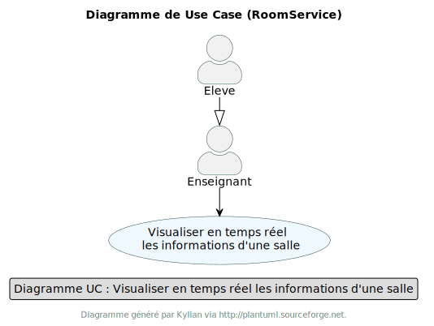
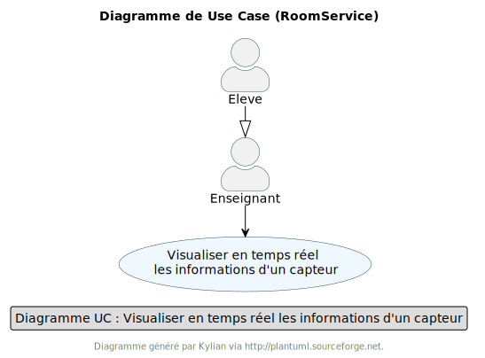
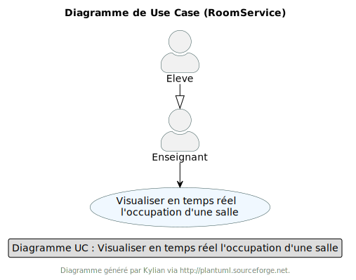

= Documentation Technique - Sujet "Occupation des salles" (Occupation)
:toc:
:toc-title: Sommaire
//:toc: preamble
:toclevels: 5
:sectnums:
:sectnumlevels: 5

:Entreprise: Groupe 1
:Equipe:  

[cols="4"]
|===
|Version | Date | Équipe | Projet
|3.0 | 8 Janvier 2024 | Groupe 1 : Kylian, Mathéo, Yann, Lylian | Développement d'une application
|=== 

== Présentation de l'Application
L'application RoomService permet aux utilisateurs d'avoir en temps réel différentes informations des salles du premier étage du département informatique de l'IUT de blagnac.
De plus, l'application RoomService permet aux utilisateurs de consulter l'historique des informations des salles du premier étage du département informatique de l'IUT de blagnac.
Enfin, l'application RoomService permet aux utilisateurs de consulter les statistiques des informations des salles du premier étage du département informatique de l'IUT de blagnac.

=== Contexte
Le contexte de l'application RoomService est le suivant :
* L'application RoomService est développée par le groupe 1 de la promotion 2024 du département informatique de l'IUT de Blagnac.
* L'application RoomService est développée pour les utilisateurs de l'IUT de Blagnac.
* L'application RoomService est développée pour les utilisateurs de l'IUT de Blagnac qui souhaitent avoir en temps réel différentes informations des salles du premier étage du département informatique de l'IUT de blagnac.
* L'application RoomService est développée pour les utilisateurs de l'IUT de Blagnac qui souhaitent consulter l'historique des informations des salles du premier étage du département informatique de l'IUT de blagnac.

=== Use Case global

L'application RoomService permet aux utilisateurs d'avoir en temps réel différentes informations des salles du premier étage du département informatique de l'IUT de blagnac.
Ces informations récupéré via les capteurs présent dans les salles sont : le taux de CO2, l'occupation des salles, la température et l'humidité.

.Diagramme de Cas d'Utilisation généraux de l'application
image::Images/Use-Case/UseCaseGénéraux.png[]

* Rôle : L'utilisateur est une personne de l'IUT de Blagnac qui souhaite avoir des informations sur les salles du premier étage du département informatique.
* Responsabilités :
** Consulter les informations des salles du premier étage du département informatique en temps réel.
** Consulter l'historique des informations des salles du premier étage du département informatique.
** Consulter les statistiques des informations des salles du premier étage du département informatique.
** Consulter les rapports des informations des salles du premier étage du département informatique.

=== Diagramme de d'architecture de la base de données

.Diagramme UML de la base de données de l'application
image::/BDD/Diagramme_uml.png[]

== Architecture de l'application

=== Générale
Schéma représentant le fonctionnement de l'application : 

image::Images/Shema/Schéma-Application.png[]

Pour plus de détail sur l'architecture général en termes de sous-systèmes pour l'application roomService, voici les éléments détaillés qui la compose :

* *Base de données* :
La base de données stocke toutes les informations relatives aux capteurs pésents dans les salles du département informatique de l'IUT de Blagnac. Elle est composée de 2 :
** *Table* :
Device : Cette table stocke les informations relatives aux capteurs présents dans les salles du département informatique de l'IUT de Blagnac. Elle est composée de 5 attributs :
*** *building* : Ce champ stocke le nom du bâtiment dans lequel se trouve le capteur.
*** *deviceName* : Ce champ stocke le nom du capteur.
*** *floor* : Ce champ stocke l'étage dans lequel se trouve le capteur.
*** *id* : Ce champ stocke l'identifiant du capteur.
*** *room* : Ce champ stocke le nom de la salle dans laquelle se trouve le capteur.

** *Table* :
Donnees : Cette table stocke les informations relatives aux données récupérées par les capteurs présents dans les salles du département informatique de l'IUT de Blagnac. Elle est composée de 9 attributs :
*** *co2* : Ce champ stocke le taux de CO2 récupéré par le capteur.
*** *activity* : Ce champ stocke l'occupation de la salle récupérée par le capteur.
*** *humidity* : Ce champ stocke l'humidité récupérée par le capteur.
*** *idDevice* : Ce champ stocke l'identifiant du capteur.
*** *illumination* : Ce champ stocke l'illumination récupérée par le capteur.
*** *temperature* : Ce champ stocke la température récupérée par le capteur.
*** *time* : Ce champ stocke la date et l'heure de la récupération des données par le capteur.
*** *tvoc* : Ce champ stocke le taux de particule fine récupéré par le capteur.

** *Table* :
Battery : Cette table stocke les informations relatives à la batterie des capteurs présents dans les salles du département informatique de l'IUT de Blagnac. Elle est composée de 2 attributs :
*** *deviceId* : Ce champ stocke l'identifiant du capteur.
*** *batteryLevel* : Ce champ stocke le niveau de batterie du capteur.

=== Ressources externes

===== Python
* Version 3.11.7*
** Python, dans le contexte de l'application RoomService, est encapsulé dans un conteneur Docker pour faciliter sa gestion, son déploiement et sa portabilité. Il est utilisé afin de pouvoir se connecter à au flux MQTT et pouvoir récupérer les données transmises par les capteurs.

===== Docker
* v24.0.7*
** Docker est utilisé pour encapsuler l'application RoomService dans un conteneur. Cela permet une gestion efficace des dépendances et des configurations, assurant la portabilité de l'application entre différents environnements. Le fichier Docker-compose fournit une configuration détaillée pour lancer l'application avec ses composants nécessaires.

===== Grafana
* v9.1.7*
** Grafana, dans le contexte de l'application RoomService, est encapsulé dans un conteneur Docker pour faciliter sa gestion, son déploiement et sa portabilité. Ce service nous permet de visualiser les données transmises par les capteurs en temps réel, de consulter l'historique des données et de générer des rapports et des statistiques détaillé.

===== Base de données
* mySQL
** Notre application posséde une base de données mySQL afin de stocker les données transmises par les capteurs allant des données captés par les capteurs telles que le taux de C2, d'humidité... jusqu'au donnée concernant l'état des capteurs telles que le niveau de batterie.

=== Structuration en packages de l’application

===== Général

[source]
----
├── BDD
├── Docker
    └── Docker.php
├── Python
├── Test
----

=== Fonctionnalitées de roomService

==== `*_Utilisateur - Visualiser les données transmises par les capteurs en temps réel_*`

* *Description* : Cette fonctionnalité permet à l'utilisateur de visualiser en temps réel les données transmises par les capteurs des salles du premier étage du département informatique de l'IUT de Blagnac. Les informations affichées comprennent le taux de CO2, la température, l'humidité, l'occupation des salles, le niveau de batterie, l'illumination et le taux de particules fines (tvoc).

* *Partie de use case réalisé - scénarios éventuels* : 

.Use Case : Visualisation des données transmises par les capteurs

* *Partie du diagramme de classes données nécessaires : en lecture, en mise à jour* : 

.Diagramme de Classe : Visualisation des données transmises par les capteurs
image::

==== `*_Utilisateur - Visualisation de l'état des capteurs en temps réel_*`

* *Description* : Cette fonctionnalité permet à l'utilisateur de visualiser l'état actuel des capteurs, y compris le niveau de batterie de chaque capteur. L'information sur l'état des capteurs est cruciale pour assurer le bon fonctionnement continu de l'application RoomService.

* *Partie de use case réalisé - scénarios éventuels* : 

.Use Case : 

* *Partie du diagramme de classes données nécessaires : en lecture, en mise à jour* : 

.Diagramme de Classe : 
image::

==== `*_Utilisateur - Visualisation de l'occupation des salles en temps réel_*`

* *Description* : Cette fonctionnalité permet à l'utilisateur de surveiller en temps réel l'occupation des salles du premier étage du département informatique de l'IUT de Blagnac. L'information sur l'occupation des salles peut être cruciale pour optimiser l'utilisation des salles du département.

* *Partie de use case réalisé - scénarios éventuels* : 

.Use Case : 

* *Partie du diagramme de classes données nécessaires : en lecture, en mise à jour* : 

.Diagramme de Classe : 
image::
